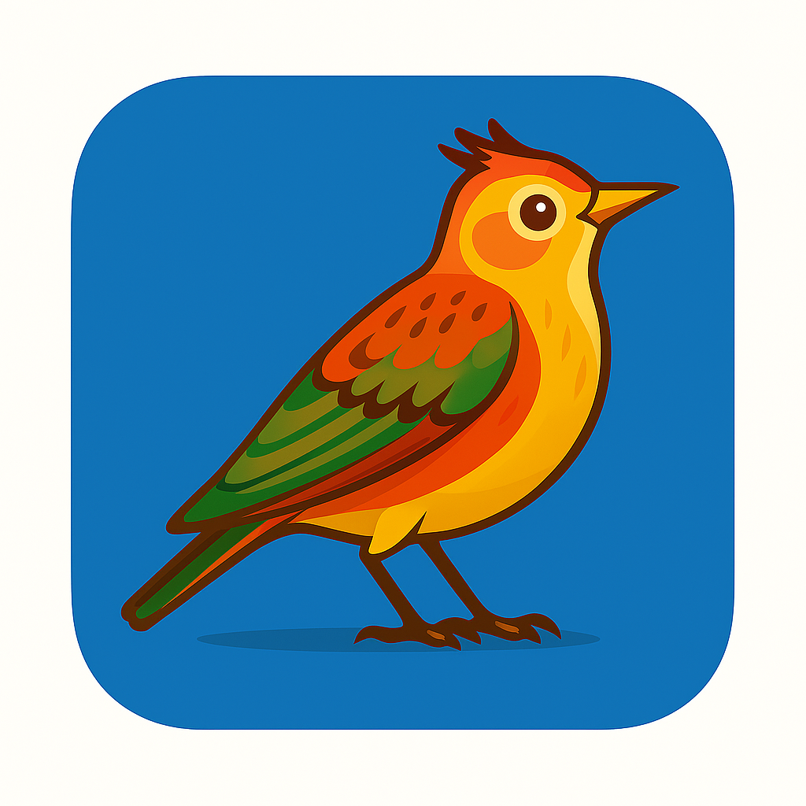

# Alouette Translator

<div align="center">
  
  
  **Alouette Translator - Cross-platform Translation Application**
  
  *A beautiful, powerful Flutter-based translation application with AI-powered translation capabilities*
  
  [](https://flutter.dev)
  [](#supported-platforms)
  [](LICENSE)
</div>

## 📖 简介 / Introduction

Alouette Translator 是一个跨平台的翻译应用程序，基于 Flutter 开发，支持通过 Ollama 和 LM Studio 等本地 AI 模型进行多语言翻译。该应用复刻了 alouette-app（Tauri 版本）的核心翻译功能，提供直观的用户界面和强大的翻译能力。

Alouette Translator is a cross-platform translation application built with Flutter, supporting AI-powered translation through local models like Ollama and LM Studio. It replicates the core translation functionality of alouette-app (Tauri version) with an intuitive user interface and powerful translation capabilities.

## ✨ 特性 / Features

### AI Translation Features

- 🤖 **本地 AI 翻译** - 支持 Ollama 和 LM Studio 本地 AI 模型
- 🌍 **多语言支持** - 支持中文、英文、日文、韩文、法文、德文、西班牙文、意大利文、俄文、阿拉伯文、印地文、希腊文
- 🔄 **批量翻译** - 一次性翻译到多个目标语言
- ⚙️ **灵活配置** - 支持自定义服务器 URL、API 密钥、模型选择
- � **实时状态** - 显示连接状态、翻译进度和模型信息

### User Interface

- 🎨 **现代化 UI** - Material 3 设计，响应式布局
- � **跨平台** - 支持 Android、iOS、Web、Windows、macOS、Linux
- 📋 **便捷操作** - 支持复制翻译结果、清除结果等操作
- ♿ **无障碍支持** - 支持屏幕阅读器和键盘导航

### Technical Features

- 🔊 **语音合成** - 集成 TTS 功能（继承自原项目）
- �️ **语音控制** - 调节语速、音量、音调等参数
- 📂 **文件支持** - 支持从文件读取文本内容
- 🔧 **错误处理** - 完善的错误处理和用户提示

## 🚀 快速开始 / Quick Start

### 环境要求 / Prerequisites

- Flutter SDK 3.8.1 或更高版本
- Dart SDK 3.0.0 或更高版本
- 对应平台的开发环境
- **Ollama 或 LM Studio** (用于 AI 翻译功能)

### AI 模型设置 / AI Model Setup

#### Ollama 设置

1. 安装 Ollama: https://ollama.ai
2. 启动 Ollama 服务: `ollama serve`
3. 下载模型: `ollama pull llama3.2` 或其他支持的模型
4. 配置外部访问 (可选):

   ```bash
   # 创建 systemd override 目录
   sudo mkdir -p /etc/systemd/system/ollama.service.d

   # 创建 override 配置
   sudo tee /etc/systemd/system/ollama.service.d/override.conf > /dev/null <<EOF
   [Service]
   Environment="OLLAMA_HOST=0.0.0.0:11434"
   EOF

   # 重新加载并重启服务
   sudo systemctl daemon-reload
   sudo systemctl restart ollama
   ```

#### LM Studio 设置

1. 安装 LM Studio: https://lmstudio.ai
2. 在 LM Studio 中加载一个模型
3. 从服务器选项卡启动本地服务器

### 安装 / Installation

1. **克隆仓库 / Clone the repository**

   ```bash
   git clone https://github.com/feuyeux/alouette-translator.git
   cd alouette-translator
   ```

2. **安装依赖 / Install dependencies**

   ```bash
   flutter pub get
   ```

3. **运行应用 / Run the application**

   ```bash
   # Android
   flutter run -d android

   # iOS (需要 macOS)
   flutter run -d ios

   # Web
   flutter run -d chrome

   # Windows
   flutter run -d windows

   # macOS
   flutter run -d macos

   # Linux
   flutter run -d linux
   ```

## ⚙️ 配置 / Configuration

### LLM 服务器配置

1. 启动应用并点击右上角的 **"⚙️ 设置"** 按钮
2. 选择 LLM 提供商 (Ollama 或 LM Studio)
3. 输入服务器 URL:
   - Ollama 本地: `http://localhost:11434`
   - LM Studio 本地: `http://localhost:1234`
   - 远程服务器: `http://your-ip:port`
4. 如果需要，输入 API 密钥
5. 点击 **"测试连接"** 验证配置
6. 选择可用的模型
7. 保存配置

### 支持的模型

该应用支持与 Ollama 和 LM Studio 兼容的各种语言模型，包括但不限于:

- Llama 系列 (llama3.2, llama3.1, etc.)
- Qwen 系列
- Mistral 系列
- 其他 OpenAI 兼容的模型

## 🔧 开发 / Development

### 项目结构 / Project Structure

```
lib/
├── main.dart                           # 应用入口
├── constants/
│   └── app_constants.dart              # 应用常量
├── models/
│   └── translation_models.dart         # 翻译相关数据模型
├── pages/
│   ├── translation_page.dart           # 主翻译页面
│   └── test_translation_page.dart      # 简单测试页面
├── services/
│   ├── llm_config_service.dart         # LLM 配置服务
│   └── translation_service.dart        # 翻译服务
└── widgets/
    ├── llm_config_dialog.dart          # LLM 配置对话框
    ├── translation_input_widget.dart   # 翻译输入组件
    └── translation_result_widget.dart  # 翻译结果组件
```

## 📦 构建发布版本 / Build Release

本项目提供了自动化构建脚本，支持一键构建所有平台的发布版本。

### 使用构建脚本 / Using Build Scripts

#### macOS/Linux 用户

```bash
# 构建所有平台
./scripts/build_release.sh --all

# 构建特定平台
./scripts/build_release.sh --android-apk --ios
./scripts/build_release.sh --web --macos

# 清理后构建
./scripts/build_release.sh -c --android-apk
```

#### Windows 用户

```batch
# 构建所有平台
scripts\build_release.bat --all

# 构建特定平台
scripts\build_release.bat --android-apk --windows
```

### iOS 构建配置 / iOS Build Configuration

iOS 构建需要设置开发团队信息：

```bash
export IOS_DEVELOPMENT_TEAM=YOUR_TEAM_ID
export IOS_BUNDLE_IDENTIFIER=com.yourcompany.app
```

获取 Team ID：https://developer.apple.com/account#MembershipDetailsCard

## 🏗️ 支持的平台 / Supported Platforms

| Platform   | Status | Notes                   |
| ---------- | ------ | ----------------------- |
| 🤖 Android | ✅     | API 21+ (Android 5.0+)  |
| 🍎 iOS     | ✅     | iOS 11.0+               |
| 🌐 Web     | ✅     | Chrome, Firefox, Safari |
| 🪟 Windows | ✅     | Windows 7+              |
| 🖥️ macOS   | ✅     | macOS 10.14+            |
| 🐧 Linux   | ✅     | 64-bit systems          |

## 📁 项目结构 / Project Structure

```
lib/
├── main.dart                    # 应用入口
├── constants/                   # 常量定义
│   └── language_constants.dart  # 语言常量
├── models/                      # 数据模型
│   └── language_option.dart     # 语言选项模型
├── pages/                       # 页面
│   └── tts_home_page.dart       # 主页面
├── services/                    # 服务层
│   └── tts_service.dart         # TTS服务
├── utils/                       # 工具类
│   └── platform_utils.dart      # 平台工具
└── widgets/                     # 自定义组件
    ├── custom_app_bar.dart      # 自定义应用栏
    ├── language_selector.dart   # 语言选择器
    ├── compact_slider.dart      # 紧凑滑块
    ├── enhanced_volume_slider.dart # 增强音量滑块
    ├── tts_control_buttons.dart # TTS控制按钮
    └── tts_status_indicator.dart # TTS状态指示器
```

## 🔧 开发 / Development

### 快速运行脚本 / Quick Run Scripts

项目提供了便捷的运行脚本：

```bash
# 运行 Android
./scripts/run_android.sh

# 运行 iOS (需要 macOS)
./scripts/run_ios.sh

# 运行 Web
./scripts/run_web.sh

# 运行 macOS
./scripts/run_macos.sh

# 运行 Linux
./scripts/run_linux.sh
```

### 代码规范 / Code Style

项目使用 Flutter 官方推荐的代码规范，通过 `flutter_lints` 包进行静态分析。

运行代码检查：

```bash
flutter analyze
```

运行测试：

```bash
flutter test
```

## 🤝 贡献 / Contributing

欢迎贡献代码！请遵循以下步骤：

1. Fork 这个仓库
2. 创建你的特性分支 (`git checkout -b feature/AmazingFeature`)
3. 提交你的更改 (`git commit -m 'Add some AmazingFeature'`)
4. 推送到分支 (`git push origin feature/AmazingFeature`)
5. 打开一个 Pull Request

## 📄 许可证 / License

本项目采用 MIT 许可证 - 查看 [LICENSE](LICENSE) 文件了解详情。

## 🙏 致谢 / Acknowledgments

- [Flutter TTS](https://pub.dev/packages/flutter_tts) - 提供 TTS 功能支持
- [Flutter](https://flutter.dev) - 跨平台 UI 框架
- [Material Design](https://material.io/) - UI 设计规范

## 📞 联系 / Contact

如果你有任何问题或建议，请通过以下方式联系：

- 创建 [Issue](https://github.com/feuyeux/alouette-tts/issues)
- 发送邮件到项目维护者

---

<div align="center">
  Made with ❤️ using Flutter
</div>
